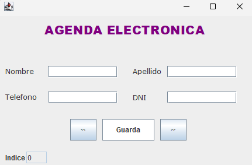

# Agenda Electrónica en Java

## Descripción

Aplicación de agenda en Java que gestiona contactos. Utiliza expresiones regulares para validar nombres, apellidos, teléfonos y DNI. Incluye manejo de excepciones para asegurar la integridad de los datos. La interfaz gráfica, desarrollada con Swing, permite guardar, visualizar y navegar entre registros.

## Funcionalidades

- **Validación de Datos**: 
  - Nombres y Apellidos: Solo letras (`[A-Za-z]+`).
  - Teléfonos: 10 dígitos (`\\d{10}`).
  - DNI: 8 dígitos (`\\d{8}`).
- **Gestión de Registros**: Guarda, visualiza, edita y navega entre contactos.
- **Manejo de Errores**: Mensajes claros para datos inválidos.

## Tecnologías

- **Lenguaje**: Java
- **Bibliotecas**: Swing para la interfaz gráfica

## Captura de Pantalla

  
